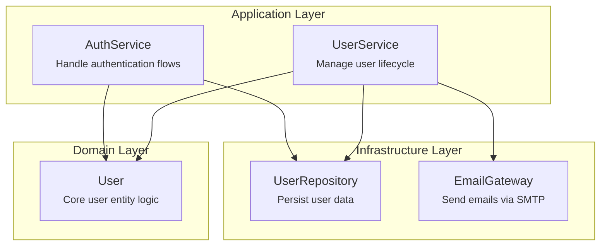
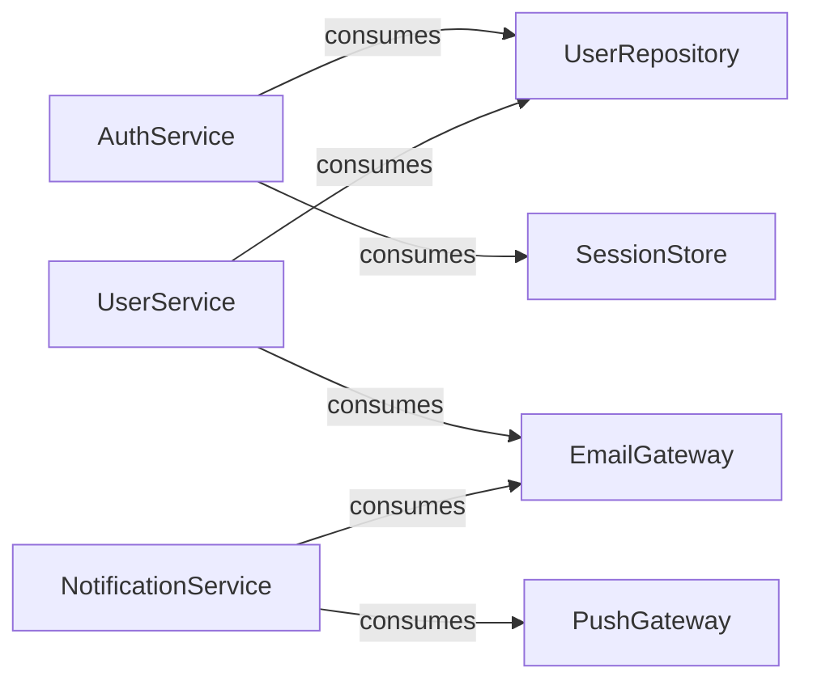
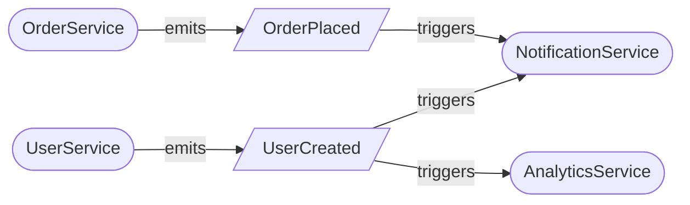
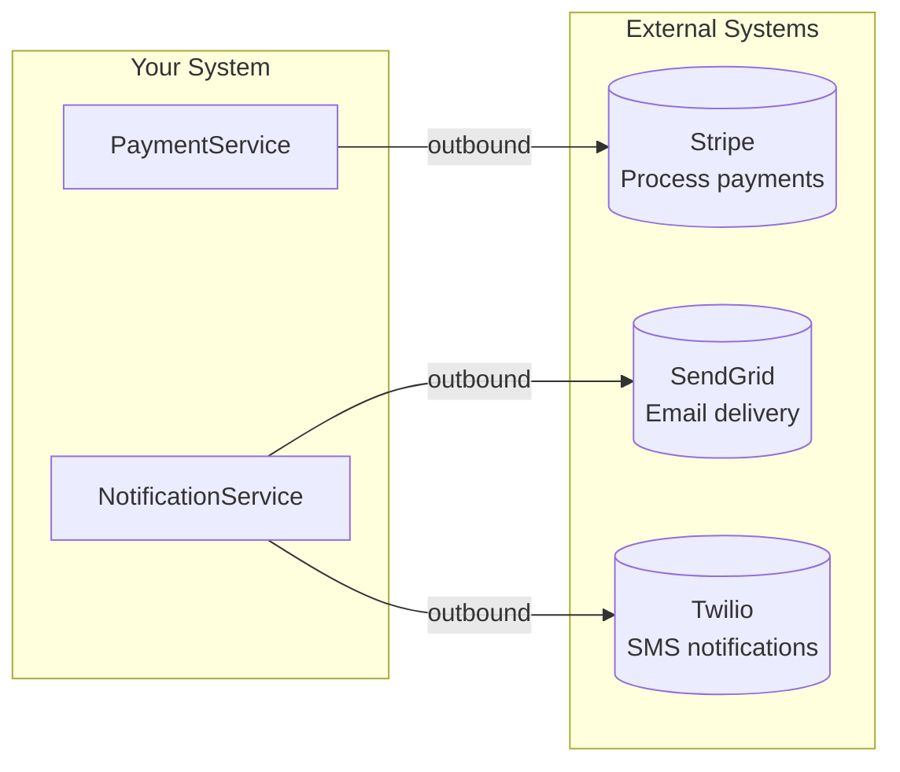

```mermaid
classDiagram
    class User {
        <<domain>>
    }
    class CreateUserInput {
        <<input>>
    }
    class CreateUserResult {
        <<output>>
    }
    class UserNotFound {
        <<error>>
    }
    class UserCreated {
        <<event>>
    }

    User <.. UserService : uses
    User <.. AuthService : uses
    CreateUserInput <.. UserService : uses
    CreateUserResult <.. UserService : uses
    UserNotFound <.. UserService : uses
    UserCreated <.. UserService : emits
```

# Mermaid Diagram Templates

Templates for generating each diagram type from spec.yaml data.

## 1. Architecture Overview

Shows components grouped by their layer, with dependency arrows.

### Template

```mermaid
graph TB
    subgraph Infrastructure["Infrastructure Layer"]
        {for each component where layer = infrastructure}
        {ComponentName}["{ComponentName}<br/><small>{for}</small>"]
        {end for}
    end

    subgraph Application["Application Layer"]
        {for each component where layer = application}
        {ComponentName}["{ComponentName}<br/><small>{for}</small>"]
        {end for}
    end

    subgraph Domain["Domain Layer"]
        {for each component where layer = domain}
        {ComponentName}["{ComponentName}<br/><small>{for}</small>"]
        {end for}
    end

    %% Dependencies (consumes relationships)
    {for each component}
    {for each consumed in component.consumes}
    {ComponentName} --> {consumed}
    {end for}
    {end for}
```

### Generation Rules

1. Group components by `layer` field (domain, application, infrastructure)
2. Display component name and `for` description in node
3. Draw arrows from consumer to consumed component
4. Use `-->` for direct dependencies
5. Layers stack: Infrastructure at top, Domain at bottom (following clean architecture)

### Example Output



---

## 2. Component Dependencies

Focused view of which components depend on which others.

### Template

```mermaid
flowchart LR
    {for each component}
    {ComponentName}
    {end for}

    {for each component}
    {for each consumed in component.consumes}
    {ComponentName} -->|consumes| {consumed}
    {end for}
    {end for}
```

### Generation Rules

1. List all components as nodes
2. Draw labeled arrows for each `consumes` relationship
3. Use `flowchart LR` for left-to-right flow (easier to read for dependencies)
4. If component has no dependencies, show as isolated node

### Example Output



---

## 3. Event Flow

Shows event-driven communication between components.

### Template

```mermaid
flowchart LR
    %% Components that emit events
    {for each component with emits}
    {ComponentName}[({ComponentName})]
    {end for}

    %% Event nodes
    {for each unique event}
    {EventName}[/{EventName}/]
    {end for}

    %% Components that subscribe
    {for each component with subscribes}
    {ComponentName}[({ComponentName})]
    {end for}

    %% Emit relationships
    {for each component}
    {for each event in component.emits}
    {ComponentName} -->|emits| {EventName}
    {end for}
    {end for}

    %% Subscribe relationships
    {for each component}
    {for each event in component.subscribes}
    {EventName} -->|triggers| {ComponentName}
    {end for}
    {end for}
```

### Generation Rules

1. Components shown as rounded rectangles `([name])`
2. Events shown as parallelograms `[/EventName/]` to distinguish from components
3. `emits` arrows point from component to event
4. `subscribes` arrows point from event to component
5. Show event payload type in tooltip if available

### Example Output



---

## 4. Type Map

Shows types grouped by category and their usage by components.

### Template

```mermaid
classDiagram
    %% Domain Types
    class DomainTypes {
        <<domain>>
        {for each type where category = domain}
        {TypeName}
        {end for}
    }

    %% Input Types
    class InputTypes {
        <<input>>
        {for each type where category = input}
        {TypeName}
        {end for}
    }

    %% Output Types
    class OutputTypes {
        <<output>>
        {for each type where category = output}
        {TypeName}
        {end for}
    }

    %% Error Types
    class ErrorTypes {
        <<error>>
        {for each type where category = error}
        {TypeName}
        {end for}
    }

    %% Event Types
    class EventTypes {
        <<event>>
        {for each type where category = event}
        {TypeName}
        {end for}
    }

    %% Usage relationships
    {for each type}
    {for each usage in type.used}
    {TypeName} <.. {usage.component} : uses
    {end for}
    {end for}
```

### Generation Rules

1. Group types by category (infer from naming pattern or `for` field)
   - Domain: Core entities (User, Order, Product)
   - Input: `*Input`, `*Request`
   - Output: `*Result`, `*Response`
   - Error: `*Error`, `*NotFound`, `*Failed`
   - Event: `*Created`, `*Updated`, `*Deleted`
2. Show type name in class box
3. Draw dashed arrows from type to components that use it
4. Use `<<stereotype>>` notation for category

### Example Output



---

## 5. Integration Map (Optional)

Shows external system integrations.

### Template

```mermaid
flowchart LR
    subgraph System["Your System"]
        {for each component that consumes integrations}
        {ComponentName}
        {end for}
    end

    subgraph External["External Systems"]
        {for each integration}
        {IntegrationName}[("{IntegrationName}<br/>{for}")]
        {end for}
    end

    {for each integration}
    {for each consumer in integration.consumed_by}
    {if direction = outbound}
    {consumer} -->|outbound| {IntegrationName}
    {else if direction = inbound}
    {IntegrationName} -->|inbound| {consumer}
    {else}
    {consumer} <-->|bidirectional| {IntegrationName}
    {end if}
    {end for}
    {end for}
```

### Generation Rules

1. Group internal components and external integrations in subgraphs
2. Show integration name and purpose
3. Arrow direction based on `direction` field:
   - `outbound`: system → external
   - `inbound`: external → system
   - `bidirectional`: two-way arrow
4. Only generate if `integrations` section exists in spec

### Example Output



---

## Output File Structure

The generated `.opensdd/spec.visual.md` should follow this structure:

```markdown
# System Visualization

> Generated from `spec.yaml` on {timestamp}
> Tech Stack: {language} / {framework} / {database}

## Table of Contents

- [Architecture Overview](#architecture-overview)
- [Component Dependencies](#component-dependencies)
- [Event Flow](#event-flow)
- [Type Map](#type-map)
- [Integration Map](#integration-map)

---

## Architecture Overview

Components organized by architectural layer.

{architecture diagram}

---

## Component Dependencies

Direct dependencies between components (`consumes` relationships).

{dependency diagram}

---

## Event Flow

Event-driven communication patterns (`emits` → `subscribes`).

{event flow diagram}

---

## Type Map

Types grouped by category with component usage.

{type map diagram}

---

## Integration Map

External system connections.

{integration diagram}

---

*Regenerate with `/opensdd:visualize`*
```

## Handling Edge Cases

### No Events
If no component has `emits` or `subscribes`, skip the Event Flow section with note:
> No event-driven patterns defined in this spec.

### No Integrations
If `integrations` section is empty or missing, skip Integration Map section with note:
> No external integrations defined in this spec.

### Large Systems (>15 components)
For large systems, consider:
1. Split Architecture Overview by layer into separate diagrams
2. Add component count warning at top
3. Suggest filtering by layer in future enhancement

### Circular Dependencies
If detected during dependency graph generation:
1. Still render the diagram (Mermaid handles cycles)
2. Add warning note above diagram highlighting the cycle
